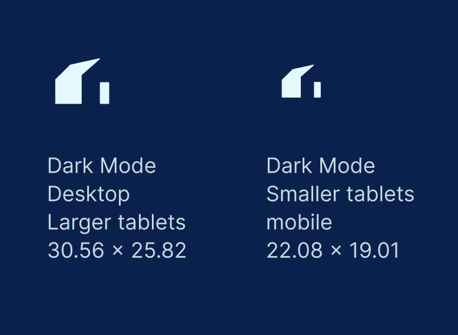
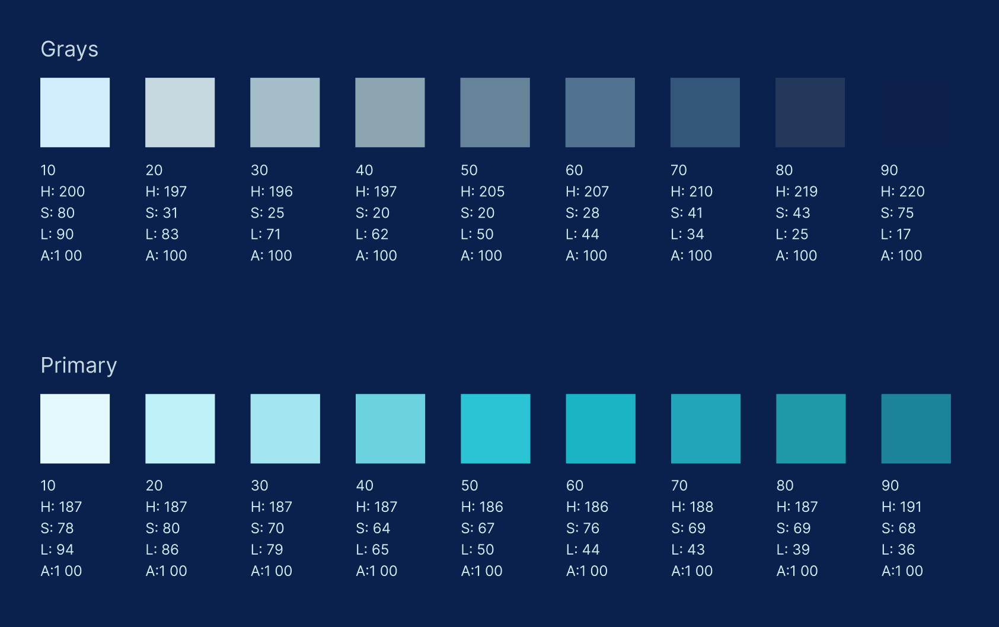
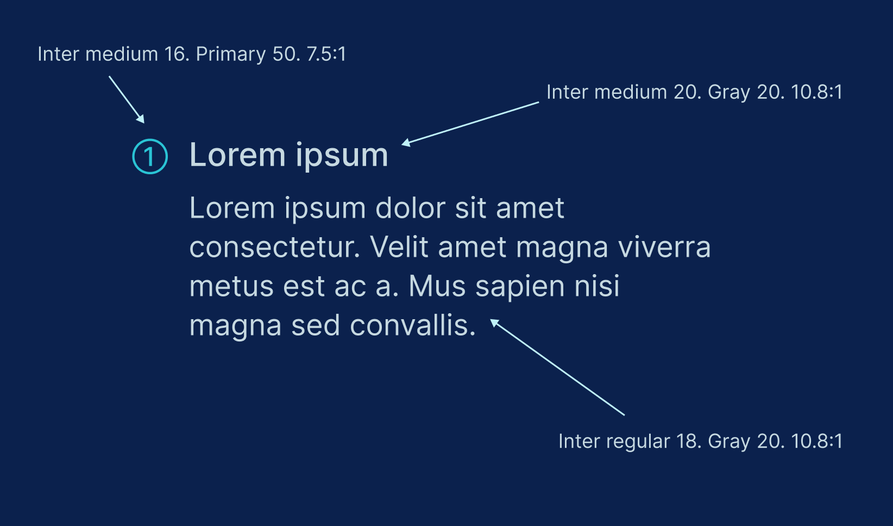
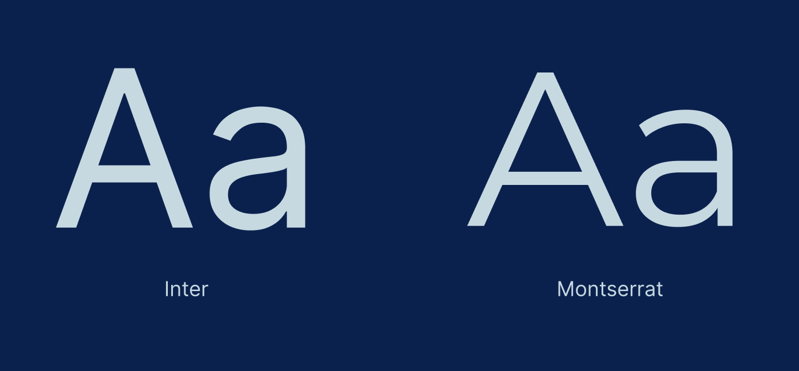

# woodshed.tech

In this document, our goal is to demonstrate how we make choices when building websites at Woodshed, a web design and development agency. You can read more about us at [woodshed.tech](https://woodshed.tech), which is built from the source code in this repository.

This document explains reasoning behind the choices we made when building woodshed.tech specifically. If you're interested in working with us, we would analyze the requirements of your project and make choices that are appropriate for your particular needs.

If you have any questions, please reach out to us at [hello@woodshed.tech](mailto:hello@woodshed.tech).

> Note: the content that follows is intended for a general audience and does not presume any programming or web development experience. If you're looking for technical documentation, head over to [./docs/developer_notes.md](./docs/developer_notes.md).

We've split this document into two main sections, [Design](#design) and [Development](#development). In truth, these are closely related practices that inform each other, but for illustrative purposes we'll explore their philosophies separately.

## Design

The essential goal of UI/UX design is to match the visual aesthetic of a product to its overall goals and mission. If there is a good fit brand-wise, and the product is well-engineered, then the user / customer will naturally associate the website with a positive, useful experience.

### Style Guide

There are many small choices to make when building up a design. We can best summarize them in a style guide, which we use to keep our designs consistent and on-brand.

The following is an excerpt from the Woodshed style guide, which helps explain the basis for our visual language.

#### About

**Personality**

It’s perhaps best to start with where the brand name comes from.

> The term woodshedding in jazz means more than just practicing. It is a recognition of the need to sequester oneself and dig into the hard mechanics of the music before you can come back and play with a group in public.
> _Paul Klemperer, [jazzthink.com](http://www.jazzthink.com/ezine/1606_ezine.html)_

Within this definition we can summarize our personality through values such as being upfront, hard-working, open-minded, balanced, collaborative, intentional, consistent, respectful, universal and timeless.

**Look and feel**

The look and feel of the site is all about making a trustworthy, solid plan for our clients, hence the technical drawing / cyanotype aesthetic.

**Positioning**

Woodshed is a small agency that will scale in time, so we are currently a bespoke solution for small to mid-sized business’ UI/UX needs.

**Promise**

To always collaborate effectively, making strong plans and solutions for product needs both now and into the future.

#### Logo

**Look and feel**

The look and feel of the logo is a minimalistic representation of a home, shed or barn. A place that represents comfort, a place to be oneself, to relax, think, hone skills and make plans.

Its blocky aesthetic creates a a form of technical symbolism, reminiscent of speech marks, punctuation or coded language.

**Positioning**

The logo should always be placed to the top left of the page and be able to scroll alongside whatever is being displayed, essentially always being visible and clickable as a home button.

**Scale**

See measurements below. Both sizes should be inside a 40px by 40px frame to meet tap/click targets.

</img>

#### Color

**Look and feel**

The look and feel of the color is dictated by the brand aesthetic. We take our cues for the color stories through what is classically used in technical drawings and cyanotypes (for dark mode).

**Dark mode color palette**

</img>

#### Accessibility

We aim to meet at least [WCAG 2.0 level AA color contrast](https://www.w3.org/TR/WCAG20/#visual-audio-contrast), which requires:

-   Text at 18px and under must have a ratio of at least 4.5:1.
-   Larger text must have a ratio of at least 3:1. For our purposes we will define larger text as anything over 18px.

</img>

#### Typography

Fonts used are Inter and Montserrat.

Inter is a new take on the Grotesque family, (closest to Helvetica), that’s rapidly gaining popularity among designers. Even, generous spacing and open counters make this feel measured and legible. Similarities to Helvetica make this font a reference to a universal timeless classic.

Montserrat, clean and simple, a classic alternative to Gotham has become more fully featured and recognizable over the years. A great pairing with Inter in this case for larger eye-grabbing titles.

</img>

## Development

The development process consists of a series of steps which lead to a publicly available, fully functional website. One aspect of this process is choosing which tools and technologies to use. This is not the only aspect of building a good website, or even the most important, but it does influence the outcome in several important ways. Good technology choices help because they get out of your way and help you build faster. In some cases, they also allow you to deliver a better user experience by making it easier to achieve good performance.

### Web technologies

To explain our technical choices, it helps to understand the programming tools that power what you see on the internet. As with any technical domain, there are a lot of acronyms and jargon, but we hope a brief introduction will provide some useful context.

-   **Hyper Text Markup Language (HTML)** is the language of web browsers. It's composed of elements (also known as "tags"), which define the semantics of the content that they contain. For example, a `
` element contains a paragraph, whereas an `` contains an image. On its own, an HTML document provides content and semantic structure, but leaves a lot to be desired in terms of visual styling.
-   **Cascading Style Sheets (CSS)** provide the ability to take some HTML content and make it visually appealing. CSS allows us to set up fonts, colors, layouts, and animations. CSS can do more than just add visual styles, but this is its core purpose.
-   **JavaScript (JS)** is a programming language that is supported by web browsers. It's a scripting language, meaning it can "manipulate, customize, and automate the facilities of an existing system" ([Wikipedia](https://en.wikipedia.org/wiki/Scripting_language)). When it runs in a browser, it can modify HTML and CSS, adding and removing content and styling on the fly. This makes it very useful for making websites interactive.

An increasingly popular way to write JavaScript is to use **TypeScript (TS)**. TypeScript is essentially JavaScript with type checking, which is a way to validate the code and avoid common errors. TypeScript converts to JavaScript, and in the rest of this document, if we say JavaScript, we really mean either JS or TS.

### Web frameworks

It's possible to build a website by using only HTML, CSS and JS files. Another way is to use a "web framework," or suite of tools that help standardize and automate the process.

In its initial version, woodshed.tech is a simple website and it could be built without using a framework. However, there are a few reasons we decided to use a framework:

-   **Improved developer experience**

    Most frameworks are built to provide a smooth developer experience, including a fast setup and various commands that make common tasks easy and quick. This helps us keep our focus on writing code, rather than tinkering with configuration.

-   **Scalability**

    While pure HTML, CSS and JS will work fine for a smaller website, things can start to get messy as a site grows. A framework provides a standard way to organize our code into logical units that fit together, in a way that can grow to hundreds or thousands of pages without becoming messy and hard to understand.

-   **Documentation**

    Frameworks are well-documented and this gives us a large knowledge base to pull from when we need to figure out how to implement a feature or fix a bug. If we don't have write documentation for our own custom setup, it means we can spend more time on actually building the project.

-   **Tooling portability**

    As designers and developers, we're used to working with certain technologies, and many frameworks support the same tools we use in other projects. This allows us to avoid context switching as much as possible, which helps us stay productive.

It's also prudent to look ahead at how a project might grow, and whether the initial setup can meet future demands. For example, we might choose to add a blog to woodshed.tech. This is the kind of feature that is hard to build without a framework, and if we start with a framework from the beginning, it will be easier to incorporate a blog if and when we decide to do so.

#### Rendering methods

Once we decided that it was worth it to use a web framework for woodshed.tech, the next choice we needed to make was which framework to use. Frameworks describe themselves as having a few ways of "rendering" webpages, or turning them into something the browser can display for the user. These rendering methods are commonly described by the acronyms **SSG**, **SSR**, and **CSR**.

-   **Static site generation (SSG)**

    SSG is where a framework creates a set of HTML, JavaScript and CSS files _before_ the user requests them by loading the site in a browser. The content is "static", meaning it doesn't change depending on who is viewing it or when it is being viewed. The code is typically organized in templates, which can take in some data and use it to populate each individual page.

-   **Server-side rendering (SSR)**

    In contrast to static site generation, SSR is a process where the server builds the response _when the user requests it_. When a user loads the site in a browser, the server can fetch "dynamic" content, typically from a database, and use it to populate the page. Among other things, this enables user-specific data which can be protected by a login, or "authentication."

-   **Client-side rendering (CSR)**

    Another way to render dynamic, user-specific data into a webpage is to use client-side rendering. This means that the server sends a small, mostly empty HTML document to the user along with a JS file. The JS code then pulls in data from one or more servers and uses it to modify the HTML as the user interacts with the site. This means it can also support authentication, similar to SSR.

These rendering methods can be blended together, and the boundaries can get blurry. Also, some frameworks can support more than one rendering method, but they often choose to prioritize one over another.

#### CSS & Design

Another core consideration is how to write CSS within a web framework. Although you can use plain CSS files, developers often reach for a CSS tool that helps make styles easier to write and maintain. Our preferred solution is [TailwindCSS](https://tailwindcss.com/), which describes itself as a "utility-first CSS framework." TailwindCSS helps when writing CSS on a team or across multiple projects, because it removes the complexities that come from custom styles which can be spread across many files. It's also built on a design system, which is a way of defining style choices at a granular level to allow for building designs in a consistent way. In our projects at Woodshed, we use an integration to sync our design system between TailwindCSS and [Figma](https://www.figma.com/), our UI/UX design tool. We believe that close communication between design and development is paramount to an efficient workflow that produces quality websites.

### Web framework options

There are many good options when picking a web framework in 2023. Here are the choices we considered, and what our thoughts are on each one.

-   [WordPress](https://wordpress.org/) is a widely used SSR framework and Content Management System (CMS). This means it comes with an admin dashboard where you can create and edit content without any coding. It's a mature framework that powers a wide swath of the websites on the internet. However, it's designed primarily for blogs, and the codebase is mostly written in PHP. This makes it hard to customize and integrate with more modern tools which are mainly written in JavaScript. It also includes a whole set of features in its admin dashboard that would be extraneous for us, since we will be maintaining the content by writing code directly and don't need a CMS. This also rules out similar options like [Drupal](https://www.drupal.org/).
-   [React](https://react.dev/) is a JavaScript user interface (UI) library. Up until recently, it was used primarily as a way to develop single-page applications with CSR, which means you would develop most of the website in JS. This results in a good developer experience, because the developer can use the powers of a scripting language to build the UI. However, it can lead to poor user experience as the complexity of the site grows, especially if the user is on a slow network connection or using a low-memory device (i.e. a old phone in a subway). In terms of comparable UI libraries, we have the most experience in React, and it has become the de facto standard, so we didn't consider [Angular](https://angular.io/), [Vue](https://vuejs.org/) or other alternatives. There are frameworks built on top of React which offer some additional functionality (see Next.js and Remix below). We opted not to build a SPA with React, but wanted to keep the option of using it in the future if we choose to add a blog to woodshed.tech.
-   [Next.js](https://nextjs.org/) is a framework that uses React as its UI library, but empowers you to use SSG, SSR and CSR within the same website. Many developers choose to start with Next.js if they are building a React project because it offers a wide range of tools and supports React Server Components, a way to leverage React in SSR. We chose not to use Next.js because we didn't want to take the performance hit of loading and initializing React when we don't need to use it in our initial version of the site.
-   [Remix](https://remix.run/) is another framework that uses React as its UI library, so it is a natural alternative to Next.js. It has different opinions about how to load and modify data, and is built to support a pattern called "progressive enhancement," which helps in the "old phone in a subway" scenario. Although it's our preferred framework for projects that require more interactivity, we also decided not to use it for this project for the same reason that we decided against Next.js: we don't need React (yet).
-   [Eleventy](https://www.11ty.dev/) bills itself as primarily an SSG framework, but can support SSR through a plugin. It's optimized for speed, so it can handle building thousands of pages very quickly. It also allows you to selectively include UI libraries like React through something called "islands architecture." This would make it a good choice for woodshed.tech, because it would give us the ability to add a blog. It looks like an solid option with many reputable testimonials, and was our second choice for building woodshed.tech.
-   [Astro](https://astro.build/) is in the same camp as Eleventy, but has different opinions about how to organize code. We liked the structure of its `.astro` files which encapsulate HTML, CSS and JS into a single component. Coming from a React background, the component hierarchy makes a lot of sense to us. It also supports islands architecture, and allows you to add in React (or any other UI library) when and wherever you need to. If we choose to add a blog to woodshed.tech, it should be simple to get it working with Astro. In the end, we liked the balance of features and how it supported TailwindCSS out of the box.

## Have a look around

If you're interested in diving deeper into how we built [woodshed.tech](https://woodshed.tech), the best way is to have a look around. Feel free to explore the code - the main page is in [./src/pages/index.astro](./src/pages/index.astro), and this might be a good place to start.
